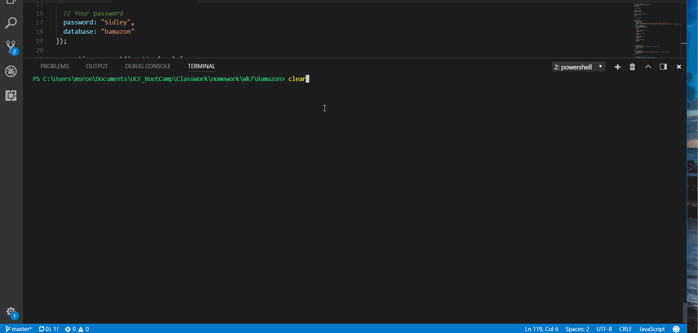

# Bamazon
An interactive node app. An Amazon-like storefront created with MySQL and Node.JS.

## Customer App
The app will take in orders from customers and deplete stock from the store's inventory. Users cannot purchase more than what is available in stock.

## Manager App
The app gives the user options to what they would like to do. 

### Author
Sharona Young

